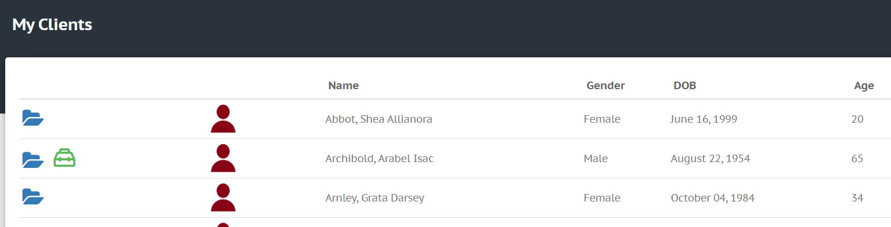

# My Clients

In the DMECC menu, navigate to "Clients" > "My Clients".

This is where you will find a list of your clients (see example below).
The clients in this table may not be all of the clients in the organization; your DMECC administrator (or manager) chooses which clients you have access to. If you do not see any clients listed in this table, or if you think someone is missing from this table, contact your organization's DMECC administrator so that they can give you access.

### Viewing Client Details
When you are granted access to client information, you can **click on the blue folder** (see "My Clients" image above) to view important details about the client.

Your organization's DMECC administrator enters the clients information into the system.

The following items are available to be entered and viewed:
- Full Name
- Common Name	
- Gender
- Date of Birth
- Username
- Email
- Address
- Telephone
- Allergies
- Emergency Contact
- Substitute Decision Maker
- Power of Attorney

# Plan of Care
If there is a green toolbox icon next to the blue folder (see image above), that means the client has an active Plan of Care. Click on this icon to open up that client's Plan of Care.

*..Remainder of this document is in progress..*
