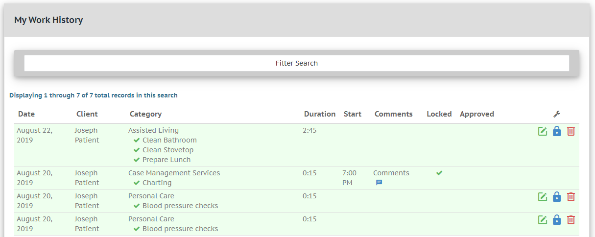

# My Work

In the DMECC menu, navigate to "Work" > "My Work".
This is where you will find a table of all the work you have performed.

>Your work-group records can be:

> - [Locked](sw_work.md#locking-work),
> - [Edited](sw_work.md#editing-work),
> - or [Deleted](sw_work.md#deleting-work)

Below is an example of a Work History table, with four work group records visible, one of which has been locked.
	

## Locking Work

Work-group records much be approved by an administrator (or manager) before they can be included in your organizations monthly reports.
When you are satisfied with the contents of your work-group record, please lock the record.

> To Lock a work-group record, click the **blue lock button**.

Once a work-group record has been locked by a Support Worker, an administrator can approve the record.

*Tip: If you need to unlock a work-group, contact your administrator. Administrators can un-lock work-group records as long as they have not already been approved.*

## Editing Work

If you need to make any changes to your work-group records, you can do so here.

> To Edit a work-group record, click the **green pen-and-paper button**.

## Deleting Work

## Filtering the Table

Your list of work history can get quite exhaustive over time. To make searching easier, follow these steps:

Click on the "Filter Search" bar to trigger a drop down menu. Within this menu, you can filter by:

- Client name
- Date range
- Both client name AND date range

Click "Search" to trigger the filter.

To remove your filter, click "Clear Fields and Show All Records".